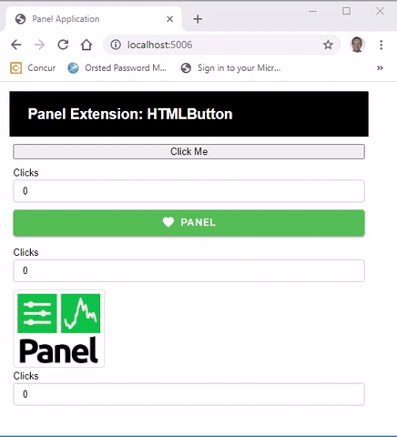
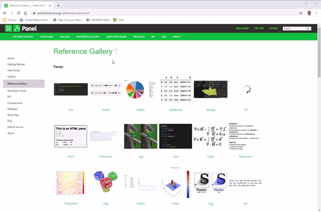

# Bokeh Extensions

**Bokeh Extensions** supports efficient, bidirectional communication from the server (Python) to the browser (Javascript) and back. It also gives you access to all the super powers of modern front end framework languages (js or typescript), tooling and frameworks like React, Vue and Angular. The layouts, panes and widgets that ships with Panel are Bokeh extensions.

Please note that in order for Bokeh Extensions to compile you will need to have [node.js](https://nodejs.org) installed. You can install it directly from their web site or via `conda install -c conda-forge nodejs`.

Before you read on I would ask you to quickly study the offical Bokeh documentation [Extending Bokeh](https://docs.bokeh.org/en/latest/docs/user_guide/extensions.html). You don't need to code and run the examples. After having read the official documentation I hope you have a basic understanding of

- the existence and location of official Bokeh documentation
- what a Bokeh extension is and how it is developed.

We will now focus on Bokeh Extensions for Panel example.

## Example

In this example we will create a Panel `HTMLButton` extension that enables a user
to catch a click event from any HTML element he/ she would like as shown below.

[](https://github.com/MarcSkovMadsen/awesome-panel-extensions/blob/master/examples/guide/html_button/html_button.py)

CLICK ON THE VIDEO TO SEE THE CODE - WALK THROUGH COMING UP

## Other Examples

**Click the images** below to see the code.

[](https://github.com/MarcSkovMadsen/awesome-panel-extensions/blob/master/examples/guide/custom_bokeh_model)

## Official Panel Examples

Every layout, pane or widget in Panel is essentially a Bokeh Extension so a good place to get inspiration is to navigate the [Panel Reference Gallery](https://panel.holoviz.org/reference/index.html) to find an extension similar to the one you would like to implement and then study the code

[](https://panel.holoviz.org/reference/index.html)

You can find the code of the Panel components on Github via

- [Panel Layouts](https://github.com/holoviz/panel/tree/master/panel/layout)
- [Panel Panes](https://github.com/holoviz/panel/tree/master/panel/pane)
- [Panel Widgets](https://github.com/holoviz/panel/tree/master/panel/widgets)

and the underlying Bokeh extensions via

- [Bokeh Model Widgets](https://github.com/bokeh/bokeh/tree/master/bokehjs/src/lib/models/widgets)
- [Panel Bokeh Models](https://github.com/holoviz/panel/tree/master/panel/models)

## Prebuilt Bokeh Extensions

COPY FROM AWESOME-PANEL.ORG REPO - TO BE REVISED

There are two ways in which the Bokeh `.ts` models can be built.

- Automatically when you run the code.
  1. If you instantiate your extension before running you use `.servable` then the extension will automatically be built and registered by Bokeh.
- Manually up front using the `panel build` command.
  2. This is referred to as *prebuilt Bokeh extensions*.

In this document I will describe how I setup the awesome-panel-extensions package for **prebuilt bokeh extensions**. **This is nescessary if you want to distribute your extensions as a package.**

I hope this description can help others who would like to develop and share Bokeh Extensions for Panel.

Setting up prebuilt extensions using `Bokeh init --interactive` is described in the Bokeh Docs. See [Bokeh Pre-built extensions](https://docs.bokeh.org/en/latest/docs/user_guide/extensions.html).

### Steps for the `awesome-panel-extensions` Package as of 20200721 Bokeh 2.1.0

I navigated to the `awesome_panel_extensions` folder (!= root of project).

```bash
cd awesome_panel_extensions
```

I ran `bokeh init --interactive`

```bash
$ bokeh init --interactive
Working directory: ...\awesome_panel_extensions
Wrote ...\awesome_panel_extensions\bokeh.ext.json
Create package.json? This will allow you to specify external dependencies. [y/n] y
  What's the extension's name? [awesome_panel_extensions]
  What's the extension's version? [0.0.1]
  What's the extension's description? [] A collection of awesome extensions for Panel
Wrote ...\awesome_panel_extensions\package.json
Create tsconfig.json? This will allow for customized configuration and improved IDE experience. [y/n] y
Wrote ...\awesome_panel_extensions\tsconfig.json
Created empty index.ts. This is the entry point of your extension.
You can build your extension with bokeh build
All done.
```

In the `package.json` I had to replace

```ts
"dependencies": {
    "bokehjs": "^2.1.0"
  },
```

with

```ts
"dependencies": {
    "@bokeh/bokehjs": "^2.1.0"
  },
```

in order to import from bokehjs in the same way as Panel does. See [bokeh init issue](https://github.com/bokeh/bokeh/issues/10055) for more info.

I also replaced the `tsconfig.json` contents with

```ts
{
  "compilerOptions": {
    "noImplicitAny": true,
    "noImplicitThis": true,
    "noImplicitReturns": true,
    "noUnusedLocals": true,
    "noUnusedParameters": true,
    "strictNullChecks": true,
    "strictBindCallApply": false,
    "strictFunctionTypes": false,
    "strictPropertyInitialization": false,
    "alwaysStrict": true,
    "noErrorTruncation": true,
    "noEmitOnError": false,
    "declaration": true,
    "sourceMap": true,
    "importHelpers": false,
    "experimentalDecorators": true,
    "module": "esnext",
    "moduleResolution": "node",
    "esModuleInterop": true,
    "resolveJsonModule": true,
    "skipLibCheck": true,
    "target": "ES2017",
    "lib": ["es2017", "dom", "dom.iterable"],
    "baseUrl": ".",
    "outDir": "./dist/lib",
    "paths": {
      "@bokehjs/*": [
        "./node_modules/@bokeh/bokehjs/build/js/lib/*",
        "./node_modules/@bokeh/bokehjs/build/js/types/*"
      ]
    }
  },
  "include": ["./**/*.ts"]
}
```

At least including the `paths` section is needed to be able to `import { div, label } from "@bokehjs/core/dom"` like @philippjfr does in Panel.

In the `index.ts` file I imported my models

```ts
import * as AwesomePanelExtensions from "./bokeh_extensions/"
export {AwesomePanelExtensions}

import {register_models} from "@bokehjs/base"
register_models(AwesomePanelExtensions as any)
```

In the `bokeh_extensions/index.ts` file I exported the `WebComponent`.

```ts
export {WebComponent} from "./web_component"
```

Then I could `build` my extension

```bash
$ panel build
Working directory: C:\repos\private\awesome-panel\package\awesome_panel
Using C:\repos\private\awesome-panel\package\awesome_panel\tsconfig.json
Compiling TypeScript (3 files)
Linking modules
Output written to C:\repos\private\awesome-panel\package\awesome_panel\dist
All done.
```

The result is in the `dist` folder.

I discovered I did not even have to do anything to `serve` the `awesome_panel_extensions.js` file.

I could just `panel serve` something.

I also added `awesome_panel_extensions/node_modules/*`to my `.gitignore` file.
