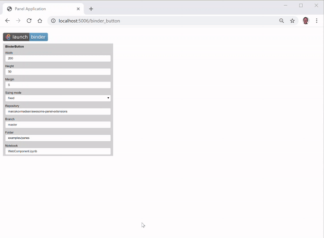

# Markdown Extensions

UPDATE: THE EXAMPLE BELOW DOES NOT WORK. SEE https://github.com/holoviz/panel/issues/1483

**Markdown Extensions** are created by inheriting from the `Markdown` pane. You can use Markdown (including HTML, CSS and/ or JS) to create amazing extensions to Panel. These extensions cannot communicate from the browser (Javascript) back to the server (Python).

## Markdown Example

In this example we will develop a `BinderButton` extension. It could have been implemented as a HTML extension just as well.

[](https://github.com/MarcSkovMadsen/awesome-panel-extensions/blob/master/examples/guide/binder_button.py)

We start by importing the dependencies

```Python
import param
import panel as pn
```

Then we implement the Markdown extension.

```python
class BinderButton(pn.pane.Markdown):
    """The BinderButton displayes the Binder badge and if clicked opens the Notebook on Binder
    in a new tab"""
    repository = param.String()
    branch = param.String()
    folder = param.String()
    notebook = param.String()

    width = param.Integer(default=200, bounds=(0, None), doc="""
        The width of the component (in pixels). This can be either
        fixed or preferred width, depending on width sizing policy.""")


    # In order to not be selected by the `pn.panel` selection process
    # Cf. https://github.com/holoviz/panel/issues/1494#issuecomment-663219654
    priority = 0

    # The _rename dict is used to keep track of Panel parameters to sync to Bokeh properties.
    # As repository etc. is not a property on the Bokeh model we should set it to None
    _rename = dict(pn.pane.Markdown._rename, repository=None, branch=None, folder=None, notebook=None)

    def __init__(self, **params):
        super().__init__(**params)

        self._update_object_from_parameters()

    # Note:
    # Don't name the function
    # `_update`, `_update_object`, `_update_model` or `_update_pane`
    # as this will override a function in the parent class.
    @param.depends(
        "repository", "branch", "folder", "notebook", "height", "width", "sizing_mode", watch=True
    )
    def _update_object_from_parameters(self, *events):
        if self.sizing_mode == "fixed":
            style = f"height:{self.height}px;width:{self.width}px;"
        elif self.sizing_mode == "stretch_width":
            style = f"width:{self.width}px;"
        elif self.sizing_mode == "stretch_height":
            style = f"height:{self.height}px;"
        else:
            style = f"height:100%;width:100%;"

        self.object = self.to_markdown(
            repository=self.repository,
            branch=self.branch,
            folder=self.folder,
            notebook=self.notebook,
            style=style,
        )

    @classmethod
    def to_markdown(self, repository: str, branch: str, folder: str, notebook: str, style: str = None):
        folder = folder.replace("/", "%2F").replace("\\", "%2F")
        url = f"https://mybinder.org/v2/gh/{repository}/{branch}?filepath={folder}%2F{notebook}"
        if style:
            image = f''
        else:
            image = f''
        markdown = f"[{image}]({url})"
        return markdown
```

Finally we try out the extension

```Python
# Create the app
button = BinderButton(
    repository="marcskovmadsen/awesome-panel-extensions",
    branch="master",
    folder="examples/panes",
    notebook="WebComponent.ipynb",
)
settings_pane = pn.WidgetBox(
    pn.Param(
        button, parameters=["repository", "branch", "folder", "notebook", "height", "width", "sizing_mode", "margin"], sizing_mode="stretch_width"
    )
)
app = pn.Column(button, settings_pane, width=500, height=800)
# Serve the app
app.servable()
```