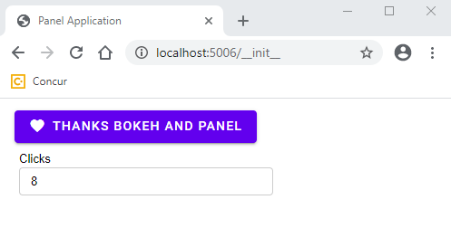

# Prebuilt Bokeh Extensions

In this document I will describe how I got **prebuilt bokeh model extensions** setup
as a part of the awesome-panel package. I needed it temporarily while waiting for the `WebComponent` PR to be reviewed and released by Panel.

Setting up prebuilt extensions using `Bokeh init --interactive` is briefly described in the Bokeh Docs. See [Bokeh Pre-built extensions](https://docs.bokeh.org/en/latest/docs/user_guide/extensions.html).

I hope this description can help others who would like to create prebuilt custom bokeh models for Bokeh or Panel.

## Steps

I navigated to the root of the awesome-panel package

```bash
cd awesome-panel/package
```

ran `bokeh init --interactive`

```bash
$ bokeh init --interactive
Working directory: C:\repos\private\awesome-panel\package\awesome_panel
Wrote C:\repos\private\awesome-panel\package\awesome_panel\bokeh.ext.json
Create package.json? This will allow you to specify external dependencies. [y/n] y
  What's the extension's name? [awesome_panel]
  What's the extension's version? [0.0.1]
  What's the extension's description? []
Wrote C:\repos\private\awesome-panel\package\awesome_panel\package.json
Create tsconfig.json? This will allow for customized configuration and improved IDE experience. [y/n] y
Wrote C:\repos\private\awesome-panel\package\awesome_panel\tsconfig.json
Created empty index.ts. This is the entry point of your extension.
You can build your extension with bokeh build
All done.
```

In the `package.json` I had to replace

```ts
"dependencies": {
    "bokehjs": "^2.0.2"
  },
```

with

```ts
"dependencies": {
    "@bokeh/bokehjs": "^2.0.2"
  },
```

See [bokeh init issue](https://github.com/bokeh/bokeh/issues/10055).

I also replaced the `tsconfig.json` contents with

```ts
{
  "compilerOptions": {
    "noImplicitAny": true,
    "noImplicitThis": true,
    "noImplicitReturns": true,
    "noUnusedLocals": true,
    "noUnusedParameters": true,
    "strictNullChecks": true,
    "strictBindCallApply": false,
    "strictFunctionTypes": false,
    "strictPropertyInitialization": false,
    "alwaysStrict": true,
    "noErrorTruncation": true,
    "noEmitOnError": false,
    "declaration": true,
    "sourceMap": true,
    "importHelpers": false,
    "experimentalDecorators": true,
    "module": "esnext",
    "moduleResolution": "node",
    "esModuleInterop": true,
    "resolveJsonModule": true,
    "skipLibCheck": true,
    "target": "ES2017",
    "lib": ["es2017", "dom", "dom.iterable"],
    "baseUrl": ".",
    "outDir": "./dist/lib",
    "paths": {
      "@bokehjs/*": [
        "./node_modules/@bokeh/bokehjs/build/js/lib/*",
        "./node_modules/@bokeh/bokehjs/build/js/types/*"
      ]
    }
  },
  "include": ["./**/*.ts"]
}
```

At least including the `path` section is needed to be able to `import { div, label } from "@bokehjs/core/dom"` like @philippjfr does in Panel.

In the `index.ts` file I imported my models

```ts
import * as AwesomePanel from "./express/models/"
export {AwesomePanel}

import {register_models} from "@bokehjs/base"
register_models(AwesomePanel as any)
```

In the `express/models/index.ts` file I exported the `WebComponent`.

```ts
export {WebComponent} from "./web_component"
```

Then I could `build` my extension

```bash
$ panel build
Working directory: C:\repos\private\awesome-panel\package\awesome_panel
Using C:\repos\private\awesome-panel\package\awesome_panel\tsconfig.json
Compiling TypeScript (3 files)
Linking modules
Output written to C:\repos\private\awesome-panel\package\awesome_panel\dist
All done.
```

The result is in the `dist` folder.

I discovered I did not even have to `serve` the `awesome_panel.js` file.

I could `panel serve` something like

```python
import param
import panel as pn
from awesome_panel.express.pane.web_component import WebComponent

MWC_ICONS = [
    None,
    "accessibility",
    "code",
    "favorite",
]  # For more icons see https://material.io/resources/icons/?style=baseline

MATERIAL = "https://cdn.jsdelivr.net/gh/marcskovmadsen/awesome-panel@be59521090b7c9d9ba5eb16e936034e412e2c86b/assets/js/mwc.bundled.js"
pn.config.js_files["material"]=MATERIAL
font_pane = pn.pane.HTML(
    """
<link href="https://fonts.googleapis.com/css?family=Roboto:300,400,500" rel="stylesheet">
<link href="https://fonts.googleapis.com/css?family=Material+Icons&display=block" rel="stylesheet">
    """, width=0, height=0, margin=0,
)

class MWCButton(WebComponent):
    html = param.String("<mwc-button></mwc-button")
    attributes_to_watch = param.Dict({"label": "name", "icon": "icon", "raised": "raised"})
    events_to_watch = param.Dict({"click": "clicks"})

    raised = param.Boolean(default=True)
    icon = param.ObjectSelector(default="favorite", objects=MWC_ICONS, allow_None=True)
    clicks = param.Integer()

    height = param.Integer(default=30)

button = MWCButton(name="Thanks Bokeh and Panel")

pn.Column(font_pane, button, pn.Param(button.param.clicks)).servable()
```

and get

