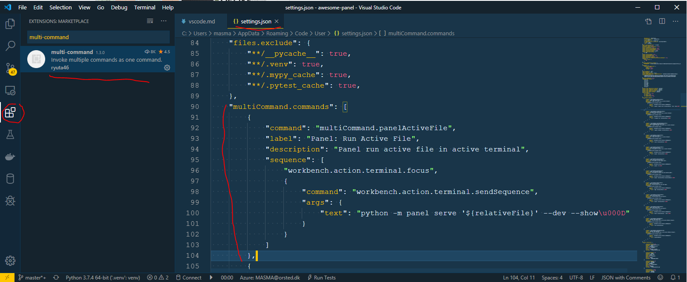
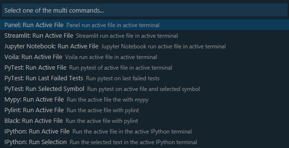
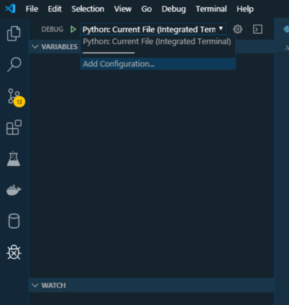
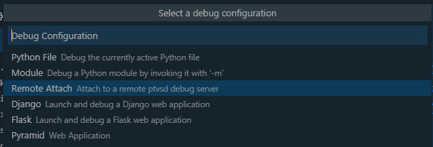
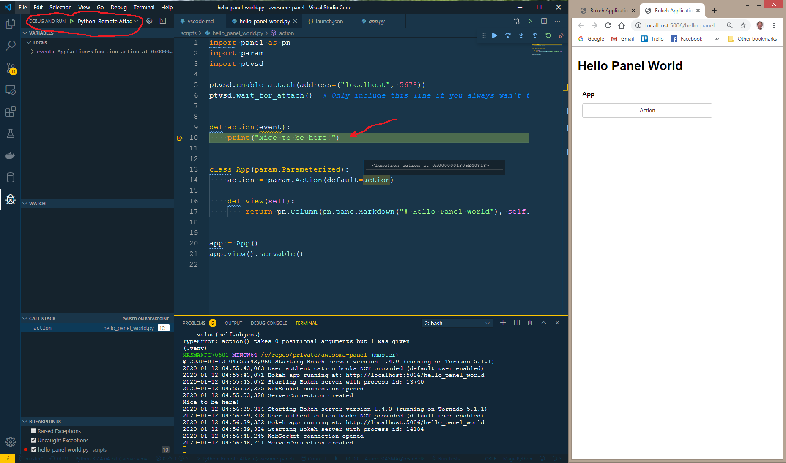
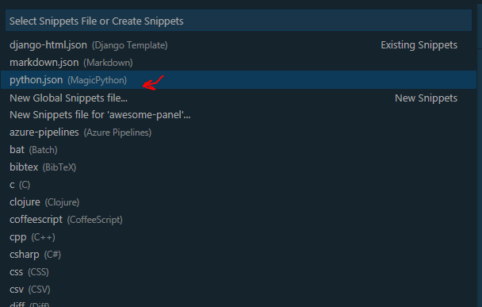
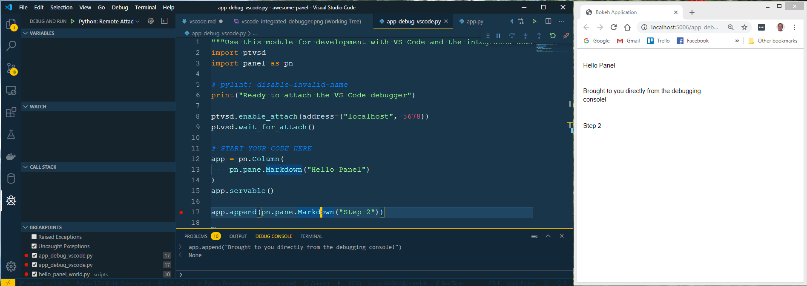
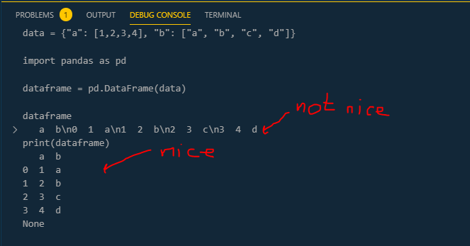

# How to use Panel with VS Code

## Running Your Panel App

You can use the [multi-command extension](https://marketplace.visualstudio.com/items?itemName=ryuta46.multi-command) to configure a keyboard short cut to execute `panel serve <relativeFile.py>` with livereload.

You start by installing the multi-command extension and adding the configuration shown to your settings.json file.



```typescript
{
    "command": "multiCommand.panelActiveFile",
    "label": "Panel: Run Active File",
    "description": "Panel run active file in active terminal",
    "sequence": [
        "workbench.action.terminal.focus",
        {
            "command": "workbench.action.terminal.sendSequence",
            "args": {
                "text": "python -m panel serve '${relativeFile}' --dev --show\u000D"
            }
        }
    ]
},
```

Then you can execute your *panel serve* command via the command palette (CTRL+SHIFT+P)




Or you can setup a keyboard shortcut in your keybindings.json file to serve Panel


```typescript
{
    "key": "ctrl+m ctrl+p",
    "command": "multiCommand.panelActiveFile",
},
```


Please **note** that I run

- `panel serve` as a module via `python -m` because its needed on Windows to make the livereload work via the `--dev` option. See [Panel Issue 790](https://github.com/holoviz/panel/issues/790#issuecomment-556106677).
- with the `--show` option to open a new tab in my browser after the server reload. It saves me a click to *Reload* the page.
- I have opened [Bokeh Issue 9501](https://github.com/bokeh/bokeh/issues/9501) to suggest a faster reload of the server and an automatic refresh of the browser tab. Please upvote if you like it.

## Debugging

### Manual Debugging

You can **debug mannually** by inserting a `breakpoint()` (Python 3.7+) or `import pdb;pdb.set_trace()` (Python 3.6 or below) in your code.

Please **note** that I often experience that my terminal freezes during debugging of Panel apps. So inserting a `breakpoint()` manually is not something I often do. As an alternative I might use a `print` or `logging.debug` statement for debugging.


### Integrated Debugging

You can also use the **integrated debugger** in VS Code via the [ptvsd](https://github.com/microsoft/ptvsd) Python package

Debugging with ptvsd on Windows with python 3.7.4 is working really well but there are reports in the Streamlit community that running ptvsd on ubuntu 18.04.3 LTS with Python 3.6.8 does not work. See [Streamlit Issue 648](https://github.com/streamlit/streamlit/issues/648).

First you should `pip install ptvsd`.

Then you need to insert the following snippet in your `<your-app_name>.py` file.

```python
import ptvsd
ptvsd.enable_attach(address=('localhost', 5678))
ptvsd.wait_for_attach() # Only include this line if you always want to attach the debugger
```

Then you should configure your *Remote Attach: debug PTVSD option*





and update to the below in your launch.json file. Please make sure that you manually insert the *redirectOutput* setting below.

```typescript
{
    "name": "Python: Remote Attach",
    "type": "python",
    "request": "attach",
    "port": 5678,
    "host": "localhost",
    "justMyCode": true,
    "redirectOutput": true,
    "pathMappings": [
        {
            "localRoot": "${workspaceFolder}",
            "remoteRoot": "."
        }
    ]
}
```

Please note that by default you will be debugging your own code only.
If you want to debug into for example the panel code, then you can change the `justMyCode` setting from `true` to `false`.

Then you can start your Panel app

```bash
panel serve <your-app_name>.py
```

Finally you can attach the debugger by clicking the debugger play button



and you can debug away.

Please **note**, that you need to re-attach the debugger when the server reloads.

#### Using a ptvsd snippet

You can create a snippet in your `python.json` snippet configuration to insert the `import ptvsd...` code.





```typescript
"ptvsd": {
    "prefix": "ptvsd debugging snippet",
    "body": [
        "import ptvsd",
        "ptvsd.enable_attach(address=('localhost', 5678))",
        "print('Ready to attach the VS Code debugger')",
        "ptvsd.wait_for_attach() # Only include this line if you always want to attach the debugger",
    ],
    "description": "Inserts snippet to setup debugging via ptvsd"
},
```

#### Using a dedicated app_debug_vscode.py file for debugging

Adding and removing the *ptvsd* code above can be cumbersome. So a usefull trick is to setup a dedicated *app_debug_vscode.py* file for debugging.

Assuming your app.py file has a `def main():` function, then your *app_debug_vscode.py* file could look as follows

```python
"""Use this module for development with VS Code and the integrated debugger"""
import ptvsd
import panel as pn

print("Ready to attach the VS Code debugger")

ptvsd.enable_attach(address=("localhost", 5678))
ptvsd.wait_for_attach()

# START YOUR CODE HERE
import app

app.main().servable()
```

then you run `panel serve app_debug_vscode.py` instead of `panel serve app.py` and attach the debugger.

For a use case see my [app.py](https://github.com/MarcSkovMadsen/awesome-panel/blob/master/app.py) and [app_dev_vscode.py](https://github.com/MarcSkovMadsen/awesome-panel/blob/master/app_dev_vscode.py) files.

#### Using the integrated Debugging Console

When you are running your integrated debugging in VS Code, you can use the *Debugging Console* with
Panel. Then you can write dataframes and charts to the browser window
and take a better look at your data, than you can in VS Code. You can also add or remove a Viewable to and from any layout.




You should also remember to *print* your dataframes to the debugger console to get a useable formatting.



### Increasing the log level

You can add `--log-level=debug` to your `panel serve` command to increase the level of logging from panel it self.

### Additional Resources

The Debugging section been developed on top of many great sources

- [Bokeh - VS Code Debugging](https://discourse.bokeh.org/t/debugging-recommendations/3934/6)
- [VS Code Debugging](https://code.visualstudio.com/Docs/editor/debugging)
- [PyCharm Debugging](https://discourse.bokeh.org/t/debugging-bokeh-serve-application-using-pycharm/1549/7)
